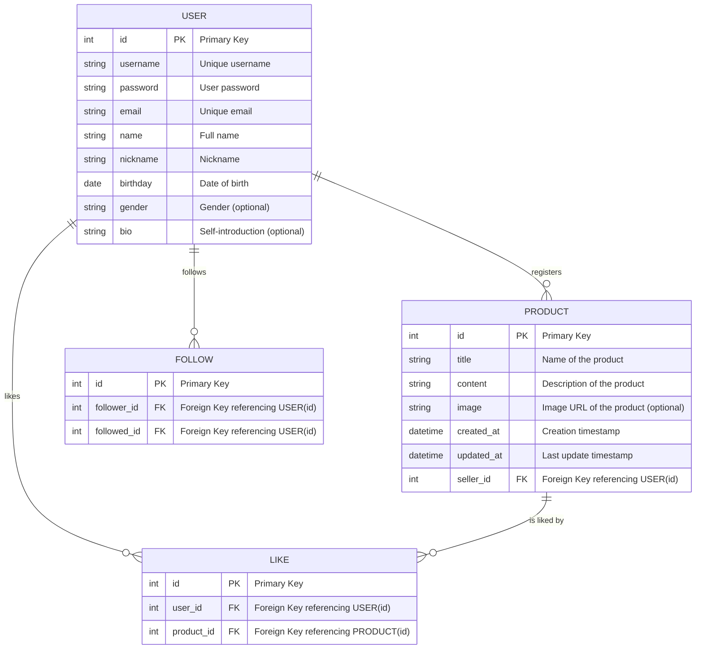

# DRF로 스파르타 마켓 구현해보기기🔥

## 1. Goal
### 💡주제
우리를 위한 중고거래 :: 스파르타 마켓
'스파르타 마켓 백엔드 기능'을 구현하기

### 🎯목표
- DRF는 RESTful API를 쉽게 만들 수 있도록 도와주는 Django의 확장 패키지입니다!
    - **REST API**는 클라이언트 -서버 간에 데이터를 JSON, XML 등과 같은 형식으로 주고받기 위해 사용됩니다.
    - **Serializer**는 Django 모델을 JSON, XML 등으로 변환하거나, 반대로 변환하는 기능을 제공합니다.

---
## 2. 구현 주제 설명

### 설명
- 각 유저는 자신의 물건을 등록 할 수 있습니다.
- 지역별 유저는 고려하지 않습니다. 우리는 모두 스파르타 이웃이니까요.
- 구매하기 기능은 구현하지 않습니다.
- 프로젝트 명은 `spartamarket_DRF` 입니다.
    - 아래의 앱은 필수로 포함하며, 이외에는 자유롭게 구현해 주세요.
        - `accounts` - 계정 관련 기능
        - `products` - 상품 관련 기능
- 모든 API는 RESTful 원칙을 따라야 합니다.

---
## 3. 필수 구현 기능

### **MVP(Minimum Viable Product)**
- **회원가입**
    - **Endpoint**: **`/api/accounts`**
    - **Method**: **`POST`**
    - **조건**: username, 비밀번호, 이메일, 이름, 닉네임, 생일 필수 입력하며 성별, 자기소개 생략 가능
    - **검증**: username과 이메일은 유일해야 하며, 이메일 중복 검증(선택 기능).
    - **구현**: 데이터 검증 후 저장.
- **로그인**
    - **Endpoint**: **`/api/accounts/login`**
    - **Method**: **`POST`**
    - **조건**: 사용자명과 비밀번호 입력 필요.
    - **검증**: 사용자명과 비밀번호가 데이터베이스의 기록과 일치해야 함.
    - **구현**: 성공적인 로그인 시 토큰을 발급하고, 실패 시 적절한 에러 메시지를 반환.
- **프로필 조회**
    - **Endpoint**: **`/api/accounts/<str:username>`**
    - **Method**: **`GET`**
    - **조건**: 로그인 상태 필요.
    - **검증**: 로그인 한 사용자만 프로필 조회 가능
    - **구현**: 로그인한 사용자의 정보를 JSON 형태로 반환.

 

### **상품 관련 기능 및 조건 (상품등록/상품목록조회/상품수정/상품삭제)**
- **상품 등록**
    - **Endpoint**: **`/api/products`**
    - **Method**: **`POST`**
    - **조건**: 로그인 상태, 제목과 내용, 상품 이미지 입력 필요.
    - **구현**: 새 게시글 생성 및 데이터베이스 저장.
- **상품 목록 조회**
    - **Endpoint**: **`/api/products`**
    - **Method**: **`GET`**
    - **조건**: 로그인 상태 불필요.
    - **구현**: 모든 상품 목록 페이지네이션으로 반환.
- **상품 수정**
    - **Endpoint**: **`/api/products/<int:productId>`**
    - **Method**: **`PUT`**
    - **조건**: 로그인 상태, 수정 권한 있는 사용자(게시글 작성자)만 가능.
    - **검증**: 요청자가 게시글의 작성자와 일치하는지 확인.
    - **구현**: 입력된 정보로 기존 상품 정보를 업데이트.
- **상품 삭제**
    - **Endpoint**: **`/api/products/<int:productId>`**
    - **Method**: **`DELETE`**
    - **조건**: 로그인 상태, 삭제 권한 있는 사용자(게시글 작성자)만 가능.
    - **검증**: 요청자가 게시글의 작성자와 일치하는지 확인.
    - **구현**: 해당 상품을 데이터베이스에서 삭제.
    

---
## 4. ERD 작성 

---
