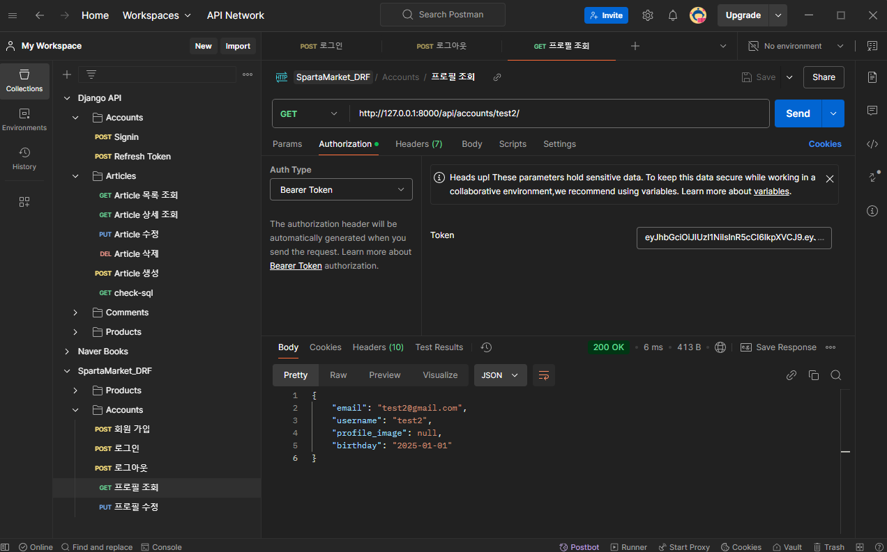

# DRF로 스파르타 마켓 구현해보기🔥

## 1. Goal
### 💡주제
우리를 위한 중고거래 :: 스파르타 마켓
'스파르타 마켓 백엔드 기능'을 구현하기

### 프로젝트 목적
- 사용자 인증과 권한 관리를 통해 안전한 중고거래 플랫폼 제공 
- 상품 CRUD 기능을 Django DRF를 사용해 RESTful API형태로 구현 
- 효율적이고 확장 가능한 백엔드 시스템 구축  

---
## 2. 구현 주제 설명

### 설명
- 각 유저는 자신의 물건을 등록 할 수 있습니다.
- 지역별 유저는 고려하지 않습니다.
- 구매하기 기능은 구현하지 않습니다.
- 프로젝트 명은 `spartamarket_DRF` 입니다.
    - `accounts` - 계정 관련 기능
    - `products` - 상품 관련 기능

---
## 3. 필수 구현 기능

### **MVP(Minimum Viable Product)**
- **회원가입**
    - **Endpoint**: **`/api/accounts`**
    - **Method**: **`POST`**
    - **조건**: username, 비밀번호, 이메일, 이름, 닉네임, 생일 필수 입력하며 성별, 자기소개 생략 가능
    - **검증**: username과 이메일은 유일해야 하며, 이메일 중복 검증(선택 기능).
    - **구현**: 데이터 검증 후 저장.
- **로그인**
    - **Endpoint**: **`/api/accounts/login`**
    - **Method**: **`POST`**
    - **조건**: 사용자명과 비밀번호 입력 필요.
    - **검증**: 사용자명과 비밀번호가 데이터베이스의 기록과 일치해야 함.
    - **구현**: 성공적인 로그인 시 토큰을 발급하고, 실패 시 적절한 에러 메시지를 반환.
- **프로필 조회**
    - **Endpoint**: **`/api/accounts/<str:username>`**
    - **Method**: **`GET`**
    - **조건**: 로그인 상태 필요.
    - **검증**: 로그인 한 사용자만 프로필 조회 가능
    - **구현**: 로그인한 사용자의 정보를 JSON 형태로 반환.

 

### **상품 관련 기능 및 조건 (상품등록/상품목록조회/상품수정/상품삭제)**
- **상품 등록**
    - **Endpoint**: **`/api/products`**
    - **Method**: **`POST`**
    - **조건**: 로그인 상태, 제목과 내용, 상품 이미지 입력 필요.
    - **구현**: 새 게시글 생성 및 데이터베이스 저장.
- **상품 목록 조회**
    - **Endpoint**: **`/api/products`**
    - **Method**: **`GET`**
    - **조건**: 로그인 상태 불필요.
    - **구현**: 모든 상품 목록 페이지네이션으로 반환.
- **상품 수정**
    - **Endpoint**: **`/api/products/<int:productId>`**
    - **Method**: **`PUT`**
    - **조건**: 로그인 상태, 수정 권한 있는 사용자(게시글 작성자)만 가능.
    - **검증**: 요청자가 게시글의 작성자와 일치하는지 확인.
    - **구현**: 입력된 정보로 기존 상품 정보를 업데이트.
- **상품 삭제**
    - **Endpoint**: **`/api/products/<int:productId>`**
    - **Method**: **`DELETE`**
    - **조건**: 로그인 상태, 삭제 권한 있는 사용자(게시글 작성자)만 가능.
    - **검증**: 요청자가 게시글의 작성자와 일치하는지 확인.
    - **구현**: 해당 상품을 데이터베이스에서 삭제.
    

---
## 4. ERD 작성 

---
## 5. TroubleShooting
#### 1. URL 라우팅 문제로 로그인 함수가 호출되지 않음
문제: `login` 함수가 호출되지 않아 토큰을 발급받지 못함
원인: `accounts/urls.py`에서 `path('login', ... )`으로 작성하여 요청 URL에 `/`를 넣지 않았음
해결방법: `path('login/', ... )`으로 수정하여 문제 해결

#### 2. 회원가입 시 `birthday`필드가 입력 날짜가 아닌 현재 날짜로 저장됨
문제: 회원 가입을 할 때 입력해준 날짜가 아닌 현재 날짜로 `birthday`필드가 채워짐
원인: `birthday`의 `auto_now`가 `True`로 설정되어 있었음
해결방법: `auto_now`를 `False`로 설정하여 문제 해결

#### 3. `username`으로 인증 실패
문제: `login`에서 사용자 인증을 `username`으로 받고자 했으나 실패
원인: `User class`의 `USERNAME_FIELD`가 `email`로 설정되어 있었음
해결방법: `USERNAME_FIELD`를 `username`로 바꿔서 설정

---
## 6. Postman으로 각 기능 점검
#### 1. 회원 가입

#### 2. 로그인

#### 3. 로그아웃

#### 4. 로그인 상태에서 프로필 조회

#### 5. 로그아웃 상태에서 프로필 조회

#### 6. 상품 등록

#### 7. 상품 상세 조회

#### 8. 상품 목록 조회 

#### 9. 상품 수정

#### 10. 상품 삭제

